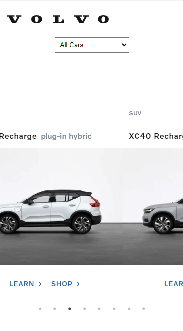

# Volvo Cars (Global Online Digital)

## Front-end coding test (React)

## Points covered

1) Links to learn and shop pages
2) Carousel to view the list of cars (used react-slick and slick-carousel)
3) Used VCC-UI design system component library
4) Filter bar on the top to filter cars by bodytype
5) Used Media queries for responsive design

## Desktop

## Mobile

